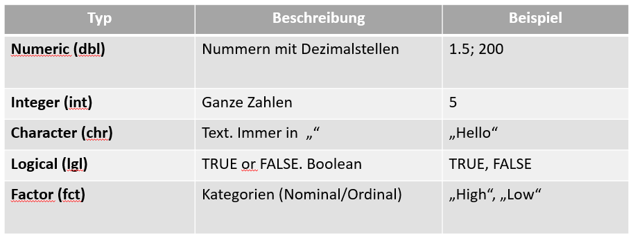
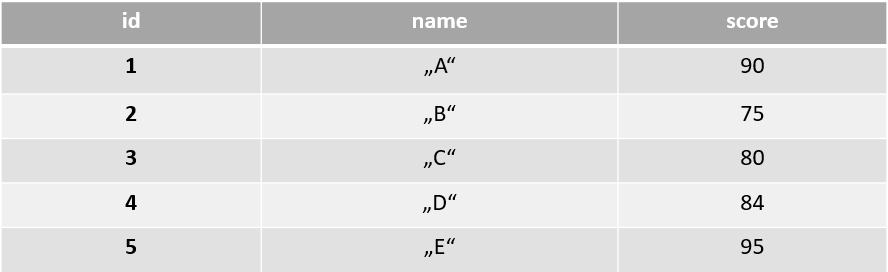
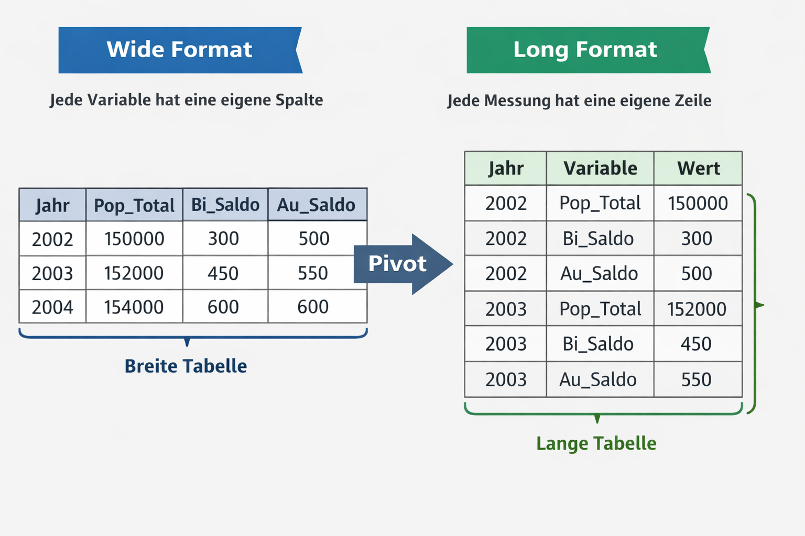

## 1. R/RStudio Basics

### 1.1. Was ist R?

R ist eine kostenlose Open-Source-Programmiersprache, die für Datenanalyse, Statistik und Visualisierung entwickelt wurde.

### 1.2. Was ist RStudio?

RStudio ist eine integrierte Entwicklungsumgebung (IDE) für R, die eine benutzerfreundliche Oberfläche zum Schreiben von Code, Verwalten von Dateien, Visualisieren von Daten und effizienten Organisieren von Projekten bietet.

### 1.3. Wie ist RStudio aufgebaut?

*--\> "4 Quadranten"*


### 1.4. Objekte und Zuweisung

R ist eine objektorientierte Sprache. Alles ist ein Objekt. Eine Zahl, eine Tabelle, ein Diagramm – alles Objekte. Objekte werden mit dem Zuweisungsoperator \<- erstellt.

Mit `Strg + Enter` können wir Code-Zeilen in der Console ausführen.

```{r}
# Erstelle ein Objekt "x" 
x <- 10 
# Rechne mit dem Objekt 
x + 5
```

### 1.5. Vektoren

Ein Vektor ist eine Liste von Dingen. Verwende c() (kombinieren), um eine Liste zu erstellen.

```{r}
my_ages <- c(25,24,30,50) 
my_names <- c("Sandra", "Paul", "Jonas")
```

Bei der Berechnung eines Vektors wird dies für jedes Element gleichzeitig durchgeführt.

```{r}
my_ages + 2
```

### 1.6. Datentypen

R muss wissen, um welche Art von Daten es sich handelt. Mathematische Berechnungen mit einem Wort führen zu einem Error.



```{r}
class(my_ages) 
class(my_names) 
# my_names + 5
```

### 1.7. Dataframes

Dies ist die" Excel-Tabelle" von R. Ein Datenrahmen ist zweidimensional: Zeilen (Beobachtungen) und Spalten (Variablen). Hier finden 99 % der Datenanalysen statt.



```{r}
df <- data.frame(id = c(1,2,3,4,5),   
                 name = c("A", "B", "C", "D", "E"),   
                 score = c(90, 75, 80, 84, 95) )
```

Der Dollarzeichen-Operator \$ wird verwendet, um eine einzelne Spalte aus einem Datenrahmen auszuwählen. "df\$score" bedeutet also: „Gehe zum Datenrahmen „df“ UND wähle die Spalte „score“ aus.

Mit der Funktion `mean()` können wir Mittelwerte von Vektoren berechnen.

```{r}
df$score 
mean(df$score)
```

Benutze str() um eine Zusammenfassung des dataframes auszugeben.

```{r}
str(df)
```

### 1.8. Packages

Packages sind Tools (oder kleine "Software") die in R für bestimmte Anwendungen geschrieben worden sind. Zum Beispiel wird das Package "ggplot" häufig für Visualisierungen verwendet. Das wichtigste Package-Bundle ist "tidyverse".

Generell können wir Pakete mit `install.packages()` installieren. Um ein bereits installiertes Paket zu laden und in unserem Skript verwenden zu können benutzen wir `library()`.

```{r}
#install.packages("tidyverse") 
library(tidyverse)
```

Das Tidyverse ist eine Sammlung aufeinander abgestimmter R-Pakete, die eine einheitliche und leicht verständliche Grammatik zum Importieren, Aufräumen, Transformieren und Visualisieren von Daten bereitstellen (im Gegensatz zu base-R).

Bei Error "Kein package namens..." -\> vergessen das Package mit `library()` zu laden.

Beispiele für wichtige und häufig verwendete Packages aus dem Tidyverse-Bundle sind `ggplot` (Visualisierung) `dplyr` (Data Manipulation, filter, select, summarize), `tidyr` (data reshaping) oder `readr` (schneller daten import)

## 2. Bevölkerungsdaten importieren, Berechnungen durchführen und plotten

Im Kurs "Quantitative Geographien" arbeiten wir mit `.csv` und `.shp` files.

Zuerst importieren wir einen Datensatz mit den jährlichen Bevölkerungszahlen im Jahresmittel von 2002-2023. (bereitgestellt auf Lernplattform)

```{r}
# Import Bevölkerungsdaten 
pop <- read.csv("data/Bevölkerungsdaten.csv")  
# Import Wanderungsdaten 
moves <- read.csv("data/Wanderungsdaten.csv")
```

Um einen ersten Überblick über die Datensätze zu erhalten, können wir die Funktionen head() und str() verwenden.

```{r}
head(pop) 
str(pop) 
names(pop)  
head(moves) 
str(moves) 
names(moves)
```

### 

### 2.1. The pipe operator %\>%

Der Pipe-Operator `%>%` (`Strg + Umschalt + M`) übergibt das Ergebnis einer Funktion an die nächste.

```{r}
pop %>%    
  filter(gemnr == 10101) %>%    
  pull(pop) %>%    
  mean()
```

Die Pipe kann man lesen als „UND DANN“. Daten nehmen, UND DANN filtern, UND DANN Bevölkerungszahlen ziehen, UND DANN Mittelwert nehmen.

### 2.2. Filter & Select

Die Datenbereinigung macht 80 % der Arbeit aus. `dplyr` bietet fünf wichtige Funktionen. Die ersten beiden reduzieren die Datengröße.

Mit `filter()` behält man nur Zeilen, die einer Bedingung entsprechen.

```{r}
pop_2002 <- pop %>%    
  filter(jahr == 2002)
```


Mit `select()` behält man nur bestimmte Spalten bei. Nützlich, um Datensätze mit vielen Spalten zu bereinigen.

```{r}
kennz <- pop_2002 %>%    
  select(gemnr)
```

### 2.3. Mutate

Oftmals müssen Sie aus alten Daten neue Daten erstellen. In unserem Fall möchten wir beispielsweise Migrationssalden berechnen. `mutate()` fügt dem Dataframe eine neue Spalte mit der gewünschten Berechnung hinzu.

Wir berechnen zuerst das **Binnenmigrationssaldo (`bi_saldo`)** und dann das **Aussenwanderungssaldo** (**`au_saldo`**) für alle Gemeinden in Österreich.

```{r}
moves <- moves %>%    
  mutate(bi_saldo = bi_zu - bi_weg,          
         au_saldo = au_zu - au_weg)
```

### 2.4. Joins

Da wir in sowohl in "`moves`" als auch in "`pop`" die gleichen Gemeindekennziffern haben, können wir die beiden dataframes vereinigen (oder "joinen"). Zuvor müssen wir allerdings die Jahre 2024 und 2025 aus dem "pop" datensatz entfernen.

```{r}
pop <- pop %>%    
  filter(!jahr %in% c(2024, 2025))
```

Wir joinen die beiden Datensätze anhand der Variablen `gemnr` und `jahr`.

Der Code verbindet die beiden Tabellen `pop` und `moves` anhand der Spalten (`by`) `gemnr` und `jahr`, sodass alle Daten aus `pop` beibehalten und die passenden Werte aus `moves` ergänzt werden.

```{r}
dta <- left_join(pop, moves, by = c("gemnr", "jahr"))
```

Die erste Zahl der Gemeindekennziffern ("`gemnr`") gibt das betreffende Bundesland an. Alle Gemeindekennziffern die mit "`7`" beginnen, sind demnach Tiroler Gemeinden.

```{r}
dta <- dta %>%   
  mutate(bld = str_sub(gemnr, 1, 1))  
# Wir ersetzen NAs mit 0 (Manche Gemeinden erfahren keine Zu- oder Abwanderung in einzelnen Jahren) 
dta[is.na(dta)] <- 0
```

Nun haben wir einen Datensatz mit dem wir weitere Berechnungen anstellen können!

### 2.5. Group By & Summarize

`group_by()` teilt die Daten in Gruppen nach einer oder mehreren Variablen, und `summarize()` berechnet dann zusammenfassende Kennzahlen (wie Summe oder Mittelwert) für jede Gruppe.

Hier berechnen wir Gesamtbevölkerungszahlen und Migrationssalden (Innen- und Aussenwanderungen) für jedes Bundesland, in dem wir die Gemeindezahlen zusammenfassen.

```{r}
bld_dta <- dta %>%    
  group_by(bld, jahr) %>%    
  summarise(pop_tot = sum(pop),             
            bi_saldo_tot = sum(bi_saldo),             
            au_saldo_tot = sum(au_saldo)) %>%    
  ungroup()  
head(bld_dta)
```

Wir berechnen je eine neue Spalte (`mutate`) mit den:

1.  **Bevölkerungsveränderungsrate**

    Die Bevölkerungsveränderungsrate ist definiert als $$\frac{Bevölkerungsstand_t - Bevölkerungsstand_{t-1}}{Bevölkerungsstand_{t-1}} \times 100$$.

    Absolute Veränderung = Differenz zwischen zwei Jahren (`pop_diff`) Rate = Differenz relativ zur Ausgangsbevölkerung (`pop_rate`)

    Die Bevölkerungsveränderungsrate gibt an, um wie viel Prozent sich die Bevölkerung eines Gebietes innerhalb eines bestimmten Zeitraums verändert hat.

<!-- -->

2.  **Binnenwanderungsrate**

    Die Binnenwanderungsrate berechnet sich als $$\frac{\text{Binnenwanderungssaldo}}{\text{Bevölkerungsstand}} \times 1000$$.

    Die Rate gibt an, wie viele Personen pro 1.000 Einwohner:innen durch Binnenmigration gewonnen oder verloren werden

3.  **Aussenwanderungsrate**

    Die Außenwanderungsrate berechnet sich als $$\frac{\text{Außenwanderungssaldo}}{\text{Bevölkerungsstand}} \times 1000$$.

    Die Außenwanderungsrate zeigt, wie viele Personen pro 1.000 Einwohner:innen durch Zu- und Wegzüge über die Staatsgrenze hinweg gewonnen oder verloren werden.

4.  **Gesamtmigrationsbilanz**

    Die Gesamtmigrationsbilanz berechnet sich als $$\text{Binnenwanderungssaldo} + \text{Außenwanderungssaldo}$$.

    Die Gesamtmigrationsbilanz zeigt den gesamten Bevölkerungsgewinn oder -verlust einer Region durch alle Wanderungsbewegungen.

    Die Gesamtmigrationsrate berechnet sich analog zu den anderen Migrationsraten als $$\frac{\text{Gesamtmigrationssaldo}}{\text{Bevölkerungsstand}} \times 1000$$.

5.  **Natürliche Bevölkerungsveränderung**

    Sieht man sich die demographische Gesamtrechnung an:

    $$ \Delta \text{Bevölkerungsveränderung} = \underbrace{\text{natürliche Veränderung}}_{\text{Geburten - Sterbefälle}} + \underbrace{\text{Binnenwanderungssaldo}}_{\text{Zu- minus Fortzüge innerhalb des Landes}} + \underbrace{\text{Außenwanderungssaldo}}_{\text{Zu- minus Fortzüge über die Staatsgrenze}} $$

    müssten wir theoretisch die natürliche Bevölkerungsveränderung mit $\text{Bevölkerungsveränderung} - \text{Gesamtmigrationssaldo}$. berechnen können.

    **ABER ACHTUNG:**

    Die auf diese Art berechneten natürlichen Bevölkerungszahlen können von offiziellen Statistiken abweichen, weil unsere Bevölkerungsstände zum Stichtag 1.1. erfasst werden, während Migrationsdaten über das Jahr verteilt für den Referenzzeitraum erhoben werden!

Die Funktion **`lag()`** verschiebt die Werte einer Variable um eine Position nach unten, sodass man den vorherigen Wert einer Beobachtung mit dem aktuellen vergleichen kann (z. B. für Zeitreihen, Differenzen oder eben das Berechnen von **relativen Veränderungen**).

```{r}
bld_dta <- bld_dta %>%    
  group_by(bld) %>%    
  mutate(pop_diff = pop_tot - lag(pop_tot),          
         pop_rate = (pop_diff / lag(pop_tot)) * 100,          
         bi_rate = (bi_saldo_tot / pop_tot) * 1000,          
         au_rate = (au_saldo_tot / pop_tot) * 1000,          
         mig_saldo = au_saldo_tot + bi_saldo_tot,          
         mig_rate = (mig_saldo / pop_tot) * 1000,          
         nat_change = (pop_tot - lag(pop_tot) - lag(mig_saldo))) %>%    
  ungroup()
```

### 2.6. The Grammar of Graphics

`ggplot2` basiert auf Ebenen. Man erstellt nicht einfach „ein Diagramm“, sondern baut es Schicht für Schicht auf, wie einen Kuchen. Die wesentlichsten Funktionen von ggplot finden sich unter

*Help-\>Cheat Sheets-\>Data Visualistion with ggplot*

Die 3 wesentlichen Schichten:

1.  Data: Der Datenframe den man plotten möchte.
2.  Aesthetics (aes): Zuordnung von Variablen zu visuellen Eigenschaften (X-Achse, Y-Achse, Farbe, Größe)
3.  Geometries (geom): Die zu zeichnende Form (oder "Art"; Bar, Point, Line)

**Das Plus Zeichen+ :** In ggplot verwenden wir **`+`** zum Hinzufügen von Ebenen, nicht die Pipe `%>%`. So können Sie ganz einfach Titel, Themen und Skalen hinzufügen.

Mit `geom_line()` erstellen wir einen Line-Chart.

```{r}
pop_tirol <- bld_dta %>% 
  filter(bld == 7) %>% 
  drop_na()

ggplot(data = pop_tirol, aes(x = jahr, y = pop_rate))+ 
  geom_col()

# Wir können mit labs() die Labels der x- und y- Axe anpassen
ggplot(data = pop_tirol, aes(x = jahr, y = pop_rate))+ 
  geom_col()+
  labs(x = " ", y = "Bevölkerungsveränderung in %")

# Wir können ein vorgefertigtes Thema mit beispielsweise theme_classic() auswählen
ggplot(data = pop_tirol, aes(x = jahr, y = pop_rate))+ 
  geom_col()+
  theme_classic()+
  labs(x = " ", y = "Bevölkerungsveränderung in %")

# mit "fill" können wir die Farbe der Balken ändern (auch mit Farbcodes möglich!)
ggplot(data = pop_tirol, aes(x = jahr, y = pop_rate))+ 
  geom_col(fill = "dodgerblue")+
  theme_classic()+
  labs(x = " ", y = "Bevölkerungsveränderung in %")

# Mittels zb. as.factor() können wir in ggplot den Datentyp angeben, ohne den ursprünglichen Dataframe zu ändern.
# Mit theme() können wir jedes Element des Diagramms ansteuern und verändern
ggplot(data = pop_tirol, aes(x = as.factor(jahr), y = pop_rate))+ 
  geom_col(fill = "firebrick")+
  theme_classic()+
  theme(axis.text.x = element_text(angle = 45, hjust = 1))+
  labs(x = " ", y = "Bevölkerungsveränderung in %", title = "Bevölkerungsveränderungrate in %; Tirol 2003-2023")
```

Mit `geom_col()` erstellen wir einen Bar-Chart. Mit `theme_classic()` können wir das Thema des Plots ändern.

```{r}

ggplot(data = pop_tirol, aes(x = jahr, y = au_saldo_tot))+ 
  geom_col()+
  theme_classic()+
  labs(x = " ", y = "Bevölkerungsveränderung absolut", title = "Bevölkerungsveränderung Tirol, 2002-2023")

ggplot(data = pop_tirol, aes(x = jahr, y = bi_saldo_tot))+ 
  geom_col()+
  theme_classic()+
  labs(x = " ", y = "Binnenwanderungssaldo", title = "Binnenwanderungssaldo Tirol, 2002-2023")

ggplot(data = pop_tirol, aes(x = jahr, y = au_saldo_tot))+ 
  geom_col()+
  theme_classic()+
  labs(x = " ", y = "Aussenwanderungssaldo", title = "Aussenwanderungssaldo Tirol, 2002-2023")

ggplot(data = pop_tirol, aes(x = jahr, y = mig_saldo))+ 
  geom_col()+
  theme_classic()+
  labs(x = " ", y = "Gesamtmigrationssaldo", title = "Gesamtmigrationssaldo Tirol, 2002-2023")
```

### 2.7. Tidy-Data

Das **Long-Format** (oder "Tidy Data") ist ein Datenformat, bei dem jede Variable eine Spalte, jede Beobachtung eine Zeile und jede Einheit eine Tabelle bildet, sodass Daten klar strukturiert und einfach analysierbar sind.

Im **Wide-Format** hat jede Variable eigene Spalten, oft mit mehreren Messzeitpunkten pro Spalte, während im **Long-Format** jede Zeile eine einzelne Beobachtung enthält und Messzeitpunkte oder Kategorien in einer eigenen Spalte stehen.



```{r}
bld_dta_long <- bld_dta %>% 
  drop_na()

## Recoding bld_dta$bld into bld_dta$bld_rec
bld_dta$bld <- bld_dta$bld %>%
  fct_recode(
    "Burgenland" = "1",
    "Kärnten" = "2",
    "Niederösterreich" = "3",
    "Oberösterreich" = "4",
    "Salzburg" = "5",
    "Steiermark" = "6",
    "Tirol" = "7",
    "Vorarlberg" = "8",
    "Wien" = "9"
  )

rates_all <- bld_dta %>% 
  select(jahr, bld, bi_rate, au_rate, mig_rate)
```

```{r}
rates_all <- rates_all %>% 
  pivot_longer(cols = c(bi_rate, au_rate, mig_rate),
               names_to = "variable",
               values_to = "value")  
```

```{r}
ggplot(data = rates_all %>% filter(bld == "Tirol"), aes(x = as.factor(jahr), y = value, col = variable, group = variable))+
  geom_line(linewidth = 1)+
  theme_classic()+
  scale_color_manual(
  values = c("au_rate" = "dodgerblue",  
             "bi_rate" = "firebrick",   
             "mig_rate" = "forestgreen"),
  labels = c("Aussenwanderungsrate", "Binnenwanderungsrate", "Gesamtwanderungsrate")
)+
  geom_hline(yintercept = 0, col = "black", linetype = "dashed")+
  labs(y = "Rate pro 1000 EW", x = " ", col = " ", title = "Migrationsstatistik Tirol, 2003-2023", caption = "Quelle: Statistik Austria")+
    theme(axis.text.x = element_text(angle = 45, hjust = 1))  

ggplot(data = rates_all %>% filter(bld == "Tirol"), aes(x = as.factor(jahr), y = value, col = variable, group = variable))+
  geom_smooth(linewidth = 1, se= F, span = 0.3)+
  theme_classic()+
  scale_color_manual(
  values = c("au_rate" = "dodgerblue",  
             "bi_rate" = "firebrick",   
             "mig_rate" = "forestgreen"), 
  labels = c("Aussenwanderungsrate", "Binnenwanderungsrate", "Gesamtwanderungsrate")
)+
  geom_hline(yintercept = 0, col = "black", linetype = "dashed")+
  labs(y = "Rate pro 1000 EW", x = " ", col = " ", title = "Migrationsstatistik Tirol, 2003-2023", caption = "Quelle: Statistik Austria")+
    theme(axis.text.x = element_text(angle = 45, hjust = 1))


ggplot(data = rates_all %>% filter(bld == "Tirol"), aes(x = as.factor(jahr), y = value, fill = variable, group = variable))+
  geom_col()+
  theme_classic()+
  scale_fill_manual(
  values = c("au_rate" = "dodgerblue",  
             "bi_rate" = "firebrick",   
             "mig_rate" = "forestgreen"), 
  labels = c("Aussenwanderungsrate", "Binnenwanderungsrate", "Gesamtwanderungsrate")
)+
  geom_hline(yintercept = 0, col = "black", linetype = "dashed")+
  labs(y = "Rate pro 1000 EW", x = " ", fill = " ", title = "Migrationsstatistik Tirol, 2003-2023", caption = "Quelle: Statistik Austria")+
    theme(axis.text.x = element_text(angle = 45, hjust = 1)) # Diese Darstellung ist fehlerhaft, warum?

ggplot(data = rates_all %>% filter(bld == "Tirol"), aes(x = as.factor(jahr), y = value, fill = variable, group = variable))+
  geom_col(position = "dodge")+
  theme_classic()+
  scale_fill_manual(
  values = c("au_rate" = "dodgerblue",  
             "bi_rate" = "firebrick",   
             "mig_rate" = "forestgreen"), 
  labels = c("Aussenwanderungsrate", "Binnenwanderungsrate", "Gesamtwanderungsrate")
)+
  geom_hline(yintercept = 0, col = "black", linetype = "dashed")+
  labs(y = "Rate pro 1000 EW", x = " ", fill = " ", title = "Migrationsstatistik Tirol, 2003-2023", caption = "Quelle: Statistik Austria")+
    theme(axis.text.x = element_text(angle = 45, hjust = 1))
  
```

Mit `facet_wrap()` oder `facet_grid()` können wir diese Darstellung auch für alle Bundesländer in einem Plot vergleichend darstellen.

```{r}
ggplot(data = rates_all %>% filter(variable != "mig_rate"),
       aes(x = as.factor(jahr), y = value, fill = variable, group = variable))+
  geom_col()+
  #theme_classic()+
  scale_fill_manual(
    values = c("au_rate" = "dodgerblue",  
               "bi_rate" = "firebrick"),
    labels = c("Aussenwanderungsrate", "Binnenwanderungsrate")
  )+
  facet_wrap(bld~.)+
  geom_hline(yintercept = 0, col = "black", linetype = "dashed")+
  labs(y = "Rate pro 1000 EW", x = " ", fill = " ",
       title = "Migrationsstatistik Österreichischer Bundesländer, 2003-2023",
       caption = "Quelle: Statistik Austria")+
  theme(axis.text.x = element_text(angle = 45, hjust = 1))
```

### 2.8. Raumtypologien

Die Urban-Rural-Typologie der Statistik Austria ist eine räumliche Klassifikation, die Gemeinden bzw. Regionen anhand von Kriterien wie Bevölkerungsdichte, strukturellen Merkmalen und Erreichbarkeit in städtische, intermediäre und ländliche Raumtypen einteilt, um statistische Analysen zu ermöglichen.

Die Urban-Rural Typologie der Statistik Austria kann im STATAtlas heruntergeladen werden: [https://www.statistik.at/atlas/?mapid=topo_regionale_gliederung_oesterreich](#0)

```{r}
typ <- read.csv2("data/003_gliederungen_nach_städtischen_und_ländlichen_gebieten(1).csv")

head(typ)
```

## 3. Sequenzanalyse

### 3.1. Was ist Sequenzanalyse?

Die **Sequenzanalyse** ist eine Methode zur Untersuchung von Abfolgen **kategorialer** Zustände über die Zeit. Im Unterschied zu klassischen statistischen Ansätzen betrachtet sie nicht nur, **welche Ereignisse auftreten**, sondern auch **in welcher Reihenfolge und Dauer** sie stattfinden. Dadurch lassen sich typische **Verlaufsformen** – etwa von Bildungs-, Erwerbs- oder Mobilitätsbiographien – sichtbar machen und miteinander vergleichen. Ebenfalls können kategorisierte Bevölkerungsveränderungen zwischen statistischen Einheiten verglichen werden.

Typische Fragestellungen, bei denen eine Sequenzanalyse sinnvoll sein kann:

Welche typischen Verlaufsformen lassen sich in den Daten erkennen, und wie unterscheiden sich diese zwischen statistischen Einheiten? Können darin typische Verlaufsmuster erkannt werden?

### 3.2. Was ist eine Sequenz?

Eine **Sequenz** ist eine geordnete Folge von Zuständen oder Ereignissen, die eine Einheit (z. B. eine Person oder Gemeinde) über mehrere Zeitpunkte hinweg durchläuft.

{width="486"}

In diesem Beispiel wären x1, x3, x4 Zustände. Die statistische Einheit (observation) durchläuft diese Zustände im Zeitverlauf.

### 3.3. Kategorisierung von Bevölkerungsveränderungsraten

Ziel in diesem Skript-Abschnitt ist es, die Bevölkerungsveränderungsraten auf Gemeindeebene zu kategorisieren und deren Ablauf mittels einer Sequenzanalyse zu vergleichen.

Wir berechnen zunächst erneut die jährliche Bevölkerungsveränderungsrate, diesmal für jede Gemeinde. Da die Raten auf Gemeindebene sehr stark fluktuieren können (zB. Eröffnung eines Pflegeheimes) verwenden wir einen **rollenden Mittelwert** als "smoothing" Technik.

Die Tabelle wird nach Gemeinde und Jahr sortiert, und mit `rollapply()` wird für jede Gemeinde ein **3-Jahres-Rolling Mean** der Bevölkerungsraten berechnet (`rate_roll3`), wobei die Mittelwerte jeweils die aktuellen und zwei vorhergehenden Jahre umfassen (`align = "right"`). Am Ende werden noch fehlende Werte entfernt und die Daten wieder entgruppiert, sodass die rollenden Mittelwerte bereit für die Kategorisierung sind.

```{r}
seq_dta <- dta %>% 
  group_by(gemnr) %>% 
  mutate(pop_diff = pop - lag(pop),
         pop_rate = (pop_diff / lag(pop)) * 100) %>% 
  ungroup() %>% 
  select(jahr, gemnr, pop_rate, bld) %>% 
  drop_na()

library(zoo)

seq_dta <- seq_dta %>% 
  arrange(gemnr, jahr) %>% 
  group_by(gemnr) %>% 
  mutate(rate_roll3 = rollapply(pop_rate,
                                width = 3,
                                FUN = mean,
                                fill = NA,
                                align = "right")) %>% 
  drop_na() %>% 
  ungroup()
```

Der Code teilt die zuvor berechneten **3-Jahres-Rolling Means der Bevölkerungsraten** (`rate_roll3`) in **vier Kategorien** ein. Mit `ntile(..., 4)` werden die Werte in **Quartile** unterteilt, sodass jede Kategorie etwa ein Viertel der Daten enthält. Anschließend werden die numerischen Quartile in **lesbare Labels** umgewandelt (`stark negativ` bis `stark positiv`), sodass die Ergebnisse leichter interpretierbar und für Visualisierungen nutzbar sind.

Mit `table(seq_dta$rate_quartile)` wird schließlich die **Häufigkeitsverteilung der Kategorien** angezeigt, sodass man schnell sehen kann, wie viele Beobachtungen in jede Gruppe fallen.

```{r}
summary(seq_dta$rate_roll3)
seq_dta <- seq_dta %>%
  mutate(rate_quartile = ntile(rate_roll3, 4),
         rate_quartile = factor(rate_quartile,
           levels = 1:4,
           labels = c("stark negativ", "negativ", "positiv", "stark positiv")
         ))

table(seq_dta$rate_quartile)
```

```{r}
seq <- seq_dta %>% 
  pivot_wider(id_cols = c(gemnr, bld),
              names_from = jahr,
              values_from = rate_quartile)

seq <- left_join(seq, typ, by = "gemnr")
seq$Wert[is.na(seq$Wert)] <- "101"
```

Der folgende Code erstellt eine **Sequenzanalyse** für die Spalten 3 bis 21 im Datensatz `seq`, die beispielsweise jährliche Veränderungen oder Ratings abbilden. Zunächst werden die Zustände der Sequenzen definiert: `seq.scode` kodiert sie intern als `"HG"`, `"G"`, `"D"` und `"HD"`, während `seq.alphabet` und `seq.labels` für die **lesbaren Bezeichnungen** sorgen („stark positiv“ bis „stark negativ“). Mit `seqdef()` werden die Daten als Sequenzen vorbereitet, inklusive Farben für die Visualisierung (`seq.cpal1`), sodass jeder Zustand konsistent dargestellt wird.

Anschließend erlaubt der Code eine **erste Exploration der Sequenzen**: `seqstatl()` zeigt die Häufigkeit der Zustände über die Zeit, `print()` und `summary()` geben Übersicht über die Sequenzen einzelner Gemeinden und deren statistische Zusammenfassung, und `seqlegend()` erzeugt eine **Legende**, die die Farben den Zuständen zuordnet. So können Studierende schnell sehen, wie sich Zustände über die Zeit verteilen und Muster in den Sequenzen erkennen.

```{r}
#install.packages("TraMineR")
library(TraMineR)

seqstatl(seq[, 3:21])
seq.alphabet <- c("stark positiv", "positiv", "negativ", "stark negativ")
seq.labels <- seq.alphabet
seq.scode <- c("HG", "G", "D", "HD")
seq.cpal1= c("#d7191c","#fec980", "#c7e6db", "#2c7bb6") 
seq.df <- seqdef (seq, var= 3:21, 
                  states=seq.scode, 
                  labels=seq.labels, 
                  alphabet=seq.alphabet, 
                  cpal = seq.cpal1)
print(seq.df[1:5, ], format="SPS")
summary(seq.df)
seqlegend(seq.df)
```

```{r}
#| fig-width: 12
#| fig-height: 10

seqiplot(seq.df, border=NA, idxs= 1:2114)
seqdplot(seq.df, main = "Sequence distribution plot", border=T) 
seqiplot(seq.df, border=NA, group = seq$Wert, idxs= 1:2114)
seqdplot(seq.df, main = "Sequence distribution plot", group = seq$Wert, border=T) 
seqfplot(seq.df, main = "Sequence frequency plot", group = seq$Wert, border=T) 
```

### 3.4. Berechnung von Distanzmaßen mit Optimal Matching

**Optimal Matching (OM)** ist eine Methode der **Sequenzanalyse**, die die **Ähnlichkeit zwischen zeitlich geordneten Ereignisfolgen** misst.

Konkret vergleicht OM zwei Sequenzen, indem es die **minimale „Bearbeitungskosten“-Summe** berechnet, die nötig ist, um die eine Sequenz in die andere zu überführen. Dabei werden drei Arten von Operationen erlaubt:

1.  **Insertion** – Einfügen eines Zustands

2.  **Deletion** – Löschen eines Zustans

3.  **Substitution** – Ersetzen eines Zustands durch einen anderen

Jede Operation wird mit einer **Kostenfunktion** versehen, sodass Sequenzen, die ähnlich verlaufen, **geringere Gesamtkosten** haben. Die resultierende Distanzmatrix kann anschließend für **Clusteranalysen**, **Multidimensionale Skalierung (MDS)** oder **Visualisierung von Sequenzmustern** verwendet werden.

**OM quantifiziert, wie „nah“ zwei zeitliche Abläufe beieinanderliegen**, und erlaubt so die Analyse von typischen Mustern und Abweichungen in Sequenzdaten.

```{r}
costs <- seqcost(seq.df, method = "INDELSLOG")
dist.om <- seqdist(seq.df, method = "OM", indel = costs$indel, sm = costs$sm)
```

### 3.5. Clustering

**Clustering** ist ein Verfahren, bei dem Beobachtungen in Gruppen (Cluster) eingeteilt werden, sodass die Objekte **innerhalb eines Clusters möglichst ähnlich** und **zwischen Clustern möglichst unterschiedlich** sind.

**Ward’s Methode** ist eine spezielle Form des **hierarchischen Clustering**. Sie arbeitet nach dem Prinzip, dass in jedem Schritt die beiden Cluster zusammengeführt werden, deren **Zusammenfassung die geringste Zunahme der Gesamtsumme der quadrierten Abweichungen (Within-Cluster-Variance)** verursacht. Anders gesagt: Ward sucht immer die Kombination, die die **homogensten Gruppen** erzeugt.

Tendenziell erzeugt dieser Clustering-Algorithmus **ähnlich große und kompakte Cluster**, was die Interpretation von Gruppenmustern erleichtert.

```{r}
#| fig-width: 12
#| fig-height: 10
wardcluster_OM <- hclust(as.dist(dist.om), method = "ward.D")
k <- 6
groups.om <- cutree(wardcluster_OM, k = k)
seqiplot(seq.df, border=NA, group = groups.om, idxs= 1:2114)
seqdplot(seq.df, main = "Sequence distribution plot", group = groups.om, border=T) 
seqfplot(seq.df, main = "Sequence frequency plot", group = groups.om, border=T) 
```

### 3.6. Bonus: Dynamic Hamming Distance

```{r}
#| fig-width: 12
#| fig-height: 10
#?seqdist
costs <- seqcost(seq.df, method = "INDELSLOG")
dist.dhd <- seqdist(seq.df, method = "DHD", indel = costs$indel)
wardcluster_DHD <- hclust(as.dist(dist.dhd), method = "ward.D")

k <- 6
groups.dhd <- cutree(wardcluster_DHD, k = k)


seqiplot(seq.df, border=NA, group = groups.dhd, idxs= 1:2114)
seqdplot(seq.df, main = "Sequence distribution plot", group = groups.dhd, border=T) 
seqfplot(seq.df, main = "Sequence frequency plot", group = groups.dhd, border=T) 
```

```{r}
seq$cluster.om <- factor(groups.om)
seq$cluster.dhd <- factor(groups.dhd)
```

## 4. Von den Daten zur Karte: Spatial Data Frames & Visualisierung

Mit dem Paket "`sf`" ("Spatial Features") kann R auch als Geoinformationssystem verwendet werden. Das Paket "mapview" ermöglicht das einfache Erstellen von interaktiven Karten. Wir installieren beide Pakete mit `install.packages()` und laden sie mit `library()`

```{r}
#install.packages(c("sf", "mapview")) library(sf) library(mapview)
library(sf)
library(mapview)
```

Um Karten zu erstellen müssen wir unserem Dataframe räumliche Informationen hinzufügen. Die Statistik Austria stellt zu diesem Zweck in ihrem STATatlas die regionale Gliederung Österreichs in Form von .shp files zur Verfügung.

Ein Shapefile ist ein älteres, sehr verbreitetes Dateiformat, mit dem man Kartenobjekte wie Punkte, Linien und Flächen samt ihren Daten speichert. Es besteht aus mehreren zusammengehörigen Dateien (z. B. .shp, .shx, .dbf), die gemeinsam in einem Ordner liegen müssen, und wird von den meisten GIS‑Programmen unterstützt.

```{r}
shp <- read_sf("data/OGDEXT_GEM_1_STATISTIK_AUSTRIA_20250101/STATISTIK_AUSTRIA_GEM_20250101.shp")  
head(shp) # in der Spalte geometry sind die Koordinaten (Punkte, Polygone, Linien) für jede Gemeinde in Österreich gespeichert
```

```{r}
#| fig-width: 12
#| fig-height: 10
shp$g_id <- as.integer(shp$g_id)
map <- left_join(seq, shp, by = c("gemnr" = "g_id")) %>% 
  st_as_sf()
## Recoding map$Wert into map$typ
map$typ <- map$Wert %>%
  fct_recode(
    "Urbane Großzentren" = "101",
    "Urbane Mittelzentren" = "102",
    "Urbane Kleinzentren" = "103",
    "Regionale Zentren, zentral" = "210",
    "Regionale Zentren, intermediär" = "220",
    "Ländlicher Raum im Umland von Zentren, zentral" = "310",
    "Ländlicher Raum im Umland von Zentren, intermediär" = "320",
    "Ländlicher Raum im Umland von Zentren, peripher" = "330",
    "Ländlicher Raum, zentral" = "410",
    "Ländlicher Raum, intermediär" = "420",
    "Ländlicher Raum, peripher" = "430"
  )

library(patchwork)
map_cluster <- ggplot(data = map) +
  geom_sf(aes(fill = cluster.dhd))+
  scale_fill_brewer(palette = "Accent")+
  theme_classic()

map_typ <- ggplot(data = map) +
  geom_sf(aes(fill = typ), color = NA) +
  scale_fill_manual(
    values = c(
      "Urbane Großzentren" = "#b35e6b",
      "Urbane Mittelzentren" = "#d67169",
      "Urbane Kleinzentren" = "#e08f81",
      "Regionale Zentren, zentral" = "#eeaf58",
      "Regionale Zentren, intermediär" = "#f5ca82",
      "Ländlicher Raum im Umland von Zentren, zentral" = "#fdf453",
      "Ländlicher Raum im Umland von Zentren, intermediär" = "#fefabb",
      "Ländlicher Raum im Umland von Zentren, peripher" = "#eeec85",
      "Ländlicher Raum, zentral" = "#c2d38c",
      "Ländlicher Raum, intermediär" = "#84b870",
      "Ländlicher Raum, peripher" = "#789d6e"
    )
  ) +
  theme_classic()

map_typ / map_cluster
#mapview(map, zcol = "cluster.dhd")
#mapview(map, zcol = "Wert")
```
